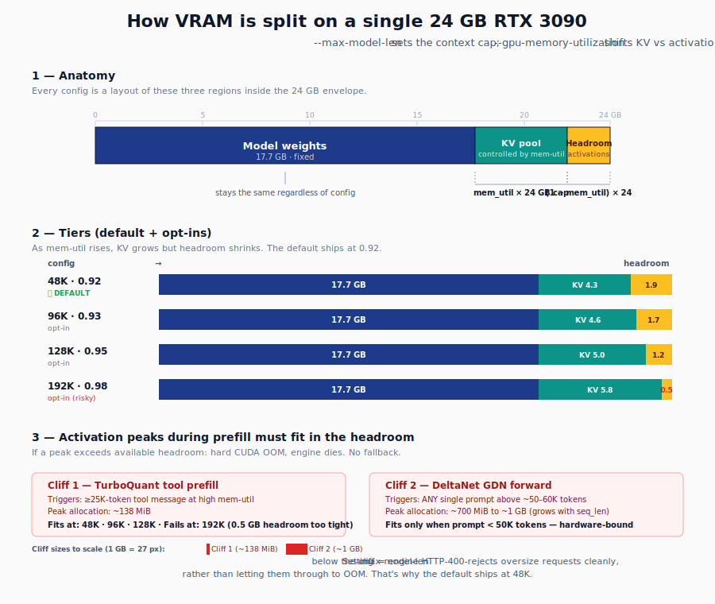

# Qwen3.6-27B on a single RTX 3090

**Run the Qwen3.6-27B language model — with vision and tool calling — on one consumer GPU.** No cloud, no API bills. Drop-in replacement for ChatGPT/Claude in any tool that uses the OpenAI SDK.

---

## TL;DR — what you'll get

- A 27-billion-parameter model running locally on **one RTX 3090** (24 GB VRAM)
- **OpenAI-compatible API** on `http://localhost:8020` — point any OpenAI SDK at it (Open WebUI, LM Studio frontends, Cline, Cursor, your own scripts)
- **All the features** from the OpenAI API: chat, vision (images in prompts), tool calling, streaming, reasoning mode
- **~50–70 tokens/second** generation speed (faster than most cloud APIs at low concurrency)
- **48K-token context** by default (configurable up to 205K with caveats — see below)
- One `docker compose up -d` after a one-time ~20 GB model download

**First time here?** → Jump to [**Quick start**](#quick-start).
**Got it running, want to compare configs?** → [Status at a glance](#status-at-a-glance).
**Hit an error?** → [Troubleshooting](#troubleshooting).
**Don't know what TPS / KV / MTP mean?** → [Glossary](#glossary) at the bottom.
**Want llama.cpp or SGLang instead of vLLM?** → [docs/engines/](docs/engines/) (comparison + recipes).

---

## Will this work for you?

| You'll need | Notes |
|---|---|
| 1× NVIDIA RTX 3090 (24 GB) | Larger Ampere/Ada cards (4090, A6000, etc.) work too. Lower VRAM cards (3060, 3080 12 GB) don't fit. |
| ~30 GB free disk | Model weights are 18 GB; the rest is Docker layers + scratch. |
| Linux (Ubuntu 22.04+ tested) | macOS/Windows won't work — vLLM is Linux + CUDA only. WSL2 *should* work but isn't tested by us. |
| Docker + NVIDIA Container Toolkit | If `docker run --rm --gpus all nvidia/cuda:12.6.0-base-ubuntu22.04 nvidia-smi` shows your GPU, you're good. |
| NVIDIA driver 580.x+ | For the CUDA 13 runtime in vLLM nightly. Run `nvidia-smi` to check. |
| Comfort with the terminal | You'll edit a YAML file once and run a few `docker compose` commands. |

**You're probably fine if:** you've used the OpenAI API before, you can run a Docker container with GPUs, and you have ~30 minutes for the first-time setup.

**Try something simpler first if:** you've never run a local LLM. [Ollama](https://ollama.com) is more forgiving and supports Qwen3 too — though it won't give you vision, MTP speculative decoding, or full OpenAI API parity.

---

## How this is built (one-paragraph version)

We use [`Lorbus/Qwen3.6-27B-int4-AutoRound`](https://huggingface.co/Lorbus/Qwen3.6-27B-int4-AutoRound) — a 4-bit quantized version of Alibaba's Qwen3.6-27B that fits in 24 GB. It runs on [vLLM](https://github.com/vllm-project/vllm) (a fast inference engine) with [Sandermage's Genesis patches](https://github.com/Sandermage/genesis-vllm-patches) (which fix several upstream Qwen3-Next bugs) plus a small in-repo patch for CUDA graph capture. The result is a stack with full feature parity to the cloud API at a small fraction of the cost.

> 📖 **Long-form write-up:** *[Qwen3.6-27B on a single RTX 3090 — the recipe](https://medium.com/)*
> 🤝 **Companion repo:** [qwen36-dual-3090](https://github.com/noonghunna/qwen36-dual-3090) — same model on 2× 3090 (262K context, 4-stream concurrency).
> 🐛 **Upstream bugs we hit & worked around:** [vllm#40807](https://github.com/vllm-project/vllm/issues/40807) (CUDA graph crash) · [vllm#40831](https://github.com/vllm-project/vllm/issues/40831) (TurboQuant × spec-decode corruption) · [vllm#40880](https://github.com/vllm-project/vllm/issues/40880) (MTP × TurboQuant cudagraph — fixed in Genesis v7.14)

---

## Status at a glance

Five configurations + five opt-in tiers on the default, all measured end-to-end on a single 3090 PCIe / 230W cap with bench prompts (1000-token narrative essay + 800-token quicksort code), `vllm/vllm-openai:nightly-07351e0883470724dd5a7e9730ed10e01fc99d08` (vLLM `dev205+g07351e088`) + Genesis v7.54. **Default (`docker compose up -d`) is 48K + 0.92** — passes all 10 verify-full.sh checks. Pick by workload; if you push past 48K read the **Activation-memory caveat** below first.

| Variant | Context | Narr TPS | Code TPS | Vision | Tools | Patches | VRAM | Notes |
|---|---|---|---|---|---|---|---|---|
| **Default** (`docker-compose.yml`) — TQ3 + Genesis P65 + MTP n=3, **48K + 0.92** ⭐⭐ | **48K** | **50.9** | **67.5** | ✅ | ✅ | Genesis v7.14+ | 21.0 GB | **What `docker compose up -d` boots.** Production-safe across the agent workload spectrum — below both prefill cliffs. All 10 verify-full.sh checks pass. Vision + tools + streaming + thinking + MTP all green. |
| **Default — opt-in 64K** (edit `max-model-len=64000`) | **64K** | 50.9 | 67.5 | ✅ | ✅ | Genesis v7.14+ | 21.5 GB | More chat-history room. Single prompts >~50K may OOM. Tool prefills ≤40K safe. |
| **Default — opt-in 96K + 0.93** | **96K** | 50.9 | 67.5 | ✅ | ✅ | Genesis v7.14+ | 22.0 GB | "Long history, small individual prompts." Single prompts >~50K OOM. Tool prefills ≤30K. |
| **Default — opt-in 128K + 0.95** | **128K** | 50.9 | 67.5 | ✅ | ✅ | Genesis v7.14+ | 22.3 GB | GPT-4 Turbo / DeepSeek-R1 ctx tier on paper. Single prompts >~50K OOM. Tool prefills ≤40K. |
| **Default — opt-in 192K + 0.98** | **192K** | 50.9 | 67.7 | ✅ | ✅ | Genesis v7.14+ | 22.3 GB | OOMs on ≥25K tool prefills ([#1](https://github.com/noonghunna/qwen36-27b-single-3090/issues/1) ampersandru's repro). Pick only if no big tool/doc prefills. |
| **Default — opt-in 205K text-only** (also uncomment `--language-model-only`) | **205K** | 50.1 | 65.8 | ❌ | ✅ | Genesis v7.14+ | 21.5 GB | Absolute single-card ceiling on TQ3 KV (engine reports 206,400 max at 0.98). Drops vision to free ~1 GB. Same prefill-OOM caveat as 192K. |
| **Fast-chat** (`docker-compose.fast-chat.yml`) — fp8 KV + MTP n=3 | 20K | **55.0** | **70.5** | ✅ | ✅ | Genesis | 22.3 GB | Best TPS at small ctx — pick for chat-only workloads ≤20K where you don't need 48K. fp8 KV sidesteps the cudagraph bug entirely. |
| **Tools-text** (`docker-compose.tools-text.yml`) — fp8 + 75K | 75K | 53.4 | 69.6 | ❌ | ✅ | Genesis | 22.2 GB | **Best long-prompt path** — fp8 KV avoids the GDN cliff at 50-60K. Pick for long single prompts (RAG, summarization) when vision isn't needed. |
| **No-Genesis MTP** (`docker-compose.no-genesis-mtp.yml`) — fp8 + MTP, no patches | 20K | 54.7 | 68.2 | ✅ | ✅ | **none** | 22.3 GB | Same as Fast-chat minus Genesis. Same TPS — Genesis is performance-neutral on the fp8+MTP path. Pick if you want to skip the patch tree. (Cross-rig peer: [u/sudeposutemizligi's TP=2 setup](#cross-rig-validation).) |
| **Minimal** (`docker-compose.minimal.yml`) — no spec-decode, fp8 KV | 32K | 32.4 | 32.6 | ✅ | ✅ | **none** | 20.8 GB | Simplest stack. No spec-decode → no #40880 trigger. Pure-bandwidth ceiling. |

### Activation-memory caveat (read this before raising `--max-model-len`)

<p align="center">
  
</p>

Two prefill-activation cliffs make 24 GB-card defaults non-trivial. vLLM's `--gpu-memory-utilization` is a **hard cap, not a soft limit** — there's no fallback or circular buffer. Whatever's outside the cap (activation peaks, fragmentation, kernel scratch) has to fit in `(1 - mem_util) × 24 GB`. The engine's pre-check guarantees the steady-state KV fits — **not the activation peak during forward**.

**Cliff 1 — TurboQuant attention scratch + tool-response prefill** (the bug ampersandru reported in [#1](https://github.com/noonghunna/qwen36-27b-single-3090/issues/1)). Triggered when a ≥25K-token tool message is loaded into the conversation at high mem_util. OOM site: TurboQuant attention forward, dequant scratch + mid_o/output buffers. Allocation typically ~138 MiB.

**Cliff 2 — DeltaNet/GLA recurrent state buffer.** Triggered by any single prompt above ~50-60K tokens (regardless of tool use). OOM site: `fla.ops.chunk.chunk_gated_delta_rule_fwd_h.h.new_empty(B, NT, H, V, K)` where NT grows linearly with prompt length. Qwen3-Next is hybrid (every 4th layer is full attention; the other 3 are GDN). GDN state is sized by total seq_len — chunked-prefill doesn't help. We can't fix this without multi-GPU TP=2 or upstream `fla.ops` changes.

| Config | Engine ceiling | Safe single-prompt | Safe tool-prefill | Best for |
|---|---|---|---|---|
| **48K + 0.92** ⭐ | ~86K | up to 48K | up to 48K | **Default.** All verify-full.sh checks pass. Production-safe; engine rejects > 48K with HTTP 400. |
| 64K + 0.92 | ~86K | up to ~50K | up to 40K | Common chat + agent flows. Single prompts >50K may OOM. |
| 96K + 0.93 | ~103K | up to ~50K | up to 30K | Long history, small individual prompts. |
| 128K + 0.95 | ~140K | up to ~50K | up to 40K | Matches GPT-4-tier on paper. Same single-prompt cliff. |
| 192K + 0.98 | ~206K | up to ~16K | up to 16K | Long-ctx recall only. OOMs on big tool prefills (ampersandru-class workload). |
| 205K + 0.98 + no vision | ~206K | up to ~16K | up to 16K | Engine ceiling. Same caveats. |

#### Defense-in-depth — three places to enforce safety

1. **`--max-model-len` (vLLM, hardest)** — engine rejects requests where `input_tokens + max_tokens > limit` with **HTTP 400** before any forward pass. **This is the only true safety net** — the cleanest UX is to set max-model-len **at or below the cliff** so oversized requests fail fast with a clean error, not an OOM crash. (Why 48K is the default: just below Cliff 2's GDN onset.)

2. **Agent-framework truncation (middle layer)** — Hermes, OpenAI Assistants, Roo Cline, LangChain, Open WebUI, Cursor and similar agent frameworks **truncate tool responses** before feeding them back into the next turn. Most default to a 10-20K-token cap on individual tool outputs. This is your second line of defense — it shapes what the agent loads back, regardless of vLLM's setting. Check your framework's docs (e.g. OpenAI's `truncation_strategy`, LangChain's `length_function` callbacks) to confirm and tune.

3. **System prompts (least reliable)** — telling the model "don't fetch >X tokens" or "summarize tool returns >5K" has weak compliance — the model passes the call to the tool, the tool returns what it returns, and the system-prompt rule doesn't gate the agent's loop. Useful as a hint, not a guarantee.

In practice: **set max-model-len to your cliff (48K) for safety; let the agent framework do realistic truncation for tool responses; don't rely on system prompts as the safety mechanism.** If a user genuinely needs longer context (some research/document workflows), have them switch to a matching opt-in config and accept the trade-off explicitly.

### Decision tree (matched to use case)

- **Tool-using agents + multi-turn coding (≤48K)** — **Default** (`docker-compose.yml`). 51/68 TPS with vision, full tool/streaming/thinking support, prefill-safe to 48K. **Recommended for anyone running Hermes / Cline / Roo / Cursor / OpenAI Assistants on this stack.**
- **Pure chat / Q&A at ≤20K, want maximum TPS** — **Fast-chat** (`docker-compose.fast-chat.yml`). 55 narrative / 70 code TPS, vision + tools work, fp8 KV. ~5-7% faster than the default for chat; no benefit on agent workloads where 20K is too tight.
- **Long single prompts (50K+ summarization or RAG)** — **Tools-text** (`docker-compose.tools-text.yml`) at 75K + fp8. fp8 KV avoids the GDN cliff at 50-60K. Trade-off: no vision.
- **Frontier context (128K-205K) for whole-codebase / long-doc workflows** — opt into the default's 128K / 192K / 205K tiers (edit `max-model-len` + `gpu-memory-utilization`). Read the caveats first.
- **Simplest stack, no patches** — **Minimal** (`docker-compose.minimal.yml`). 32 TPS, no spec-decode, no Genesis. Zero risk.
- **Skip Genesis but keep MTP TPS** — **No-Genesis MTP** (`docker-compose.no-genesis-mtp.yml`). Same 55/68 as Fast-chat.

> 📚 **Per-use-case deep dives** (gotchas, limitations, tuning levers, examples) → [docs/USE_CASES.md](docs/USE_CASES.md)
> 🔬 **Trying a different inference engine?** Comparison of vLLM / llama.cpp / SGLang for this model class → [docs/engines/](docs/engines/)

### When a single GPU isn't enough — moving to 2× 3090

A single 24 GB 3090 has hard ceilings that no amount of config tuning can clear. If you're hitting any of these, a second card is the only fix:

| Limit on 1× 3090 | Why it's stuck | What 2× 3090 unlocks |
|---|---|---|
| Single prompt > ~50K tokens crashes (Cliff 2) | DeltaNet GDN state grows linearly with seq_len; single-card activation budget runs out around 50-60K. | TP=2 splits GDN state across cards. We tested up to 90K-token prompt depth on the dual stack — passes recall ladder. |
| Per-stream TPS hard-capped at ~70 code / ~55 narr | Decode is memory-bandwidth-bound on 3090 (~936 GB/s). Single card can't go faster regardless of config. | Per-stream stays ~similar (~89 code / ~71 narr — small gain) due to PCIe-only allreduce overhead. |
| Effectively single-user — concurrent requests serialize | KV pool is already sized to fit one user's full context; 2 concurrent users mean each gets half the ctx or one waits. | 4 concurrent streams at full 262K ctx (turbo variant) — **aggregate ~257 TPS, ~5× the single-card cap** for serving. |
| Max usable context ~48K (default) or ~96K with caveats | Cliffs + activation budget. | **262K context** — full Qwen3.6 model max. fp8 KV (default) avoids the GDN cliff entirely. |
| No image generation, no concurrent vision + RAG, no multi-agent | All single-tenant. | Multi-tenant: serve a chat agent + a coding agent + a RAG endpoint concurrently. |

**When to invest in a second card:**

- ✅ You serve **multiple users / agents concurrently** (team setup, shared chat backend, multi-agent system)
- ✅ You routinely send **single prompts > 50K tokens** (whole-codebase agents, long-doc analysis, large RAG retrievals)
- ✅ You want **full 262K context with vision** (the dual stack runs this at fp8 KV + 71 narr / 89 code TPS single-stream)
- ✅ You're hitting Cliff 2 (the GDN OOM) regularly and don't want to scope your prompts around it

**When NOT to bother:**

- ❌ You're a single user doing chat or single-file coding — single-card 48K is plenty, and per-stream TPS is virtually identical
- ❌ You want maximum chat TPS at small context (the single-card `fast-chat.yml` at 55/70 TPS edges out dual-card per-stream slightly)
- ❌ You can't justify ~$700-1500 for a second card + slot/PSU upgrades

**Cost note:** PCIe-only (no NVLink bridge). The dual stack ships with NCCL_P2P_DISABLE=1 because NVLink isn't expected. Combined power draw at 230W cap each is ~460W — most ATX PSUs handle this comfortably.

> 📦 **Companion repo:** [github.com/noonghunna/qwen36-dual-3090](https://github.com/noonghunna/qwen36-dual-3090) — the same model, the same patches, plus Marlin pad-sub-tile-n (vllm#40361) and Genesis Turbo variant for 4-stream concurrency.

---

### What's not working today

- **125K context at FULL cudagraph speed (~95 TPS) WITH tool calls** — would require the proper P67 multi-query Triton kernel (designed-but-not-implemented). Until then, you pick two of three: long ctx, full TPS, working tools.
- **GGUF on vLLM for Qwen3-Next family** — not supported upstream yet. Use llama.cpp or Ollama if you specifically need GGUF.

> 📜 **Historical context** (Genesis v7.14 mechanics, the 9-probe bug isolation, upstream issue tracking, why eager.yml was removed) → [docs/INTERNALS.md](docs/INTERNALS.md)
> 📅 **Dated change log** (recent fixes, deprecations) → [CHANGELOG.md](CHANGELOG.md)

---

## Requirements

- **GPU:** 1× NVIDIA RTX 3090 (24 GB, Ampere sm_86). Tested; larger cards obviously work too.
- **Driver:** 580.x or newer (for CUDA 13 runtime in the vLLM nightly image).
- **Disk:** ~20 GB free for model weights.
- **Software:**
  - Docker with NVIDIA Container Toolkit
  - `git`, `curl`, `sha256sum` (setup script uses them)
  - `hf` CLI *or* `huggingface-cli` (install: `pip install 'huggingface-hub[hf_transfer]'`)

No system Python required.

---

## Quick start

```bash
# 1. Clone this repo
git clone https://github.com/noonghunna/qwen36-27b-single-3090.git
cd qwen36-27b-single-3090

# 2. Fetch Genesis patches + download + SHA-verify the model (~20 GB, 10-30 min)
bash scripts/setup.sh

# 3. Start the server
cd compose && docker compose up -d

# 4. Watch it come up (~2 min for cold compile)
docker logs -f vllm-qwen36-27b
# Wait for "Application startup complete"

# 5. Sanity test
curl -sf http://localhost:8020/v1/chat/completions \
  -H "Content-Type: application/json" \
  -d '{"model":"qwen3.6-27b-autoround",
       "messages":[{"role":"user","content":"Capital of France?"}],
       "max_tokens":30}'

# 6. Run the canonical benchmark
cd .. && bash scripts/bench.sh
```

That's it. The stack serves on `http://localhost:8020/v1/*` as a drop-in OpenAI-compatible endpoint — point any OpenAI SDK, Open WebUI, LM Studio, or Cline at it.

### What success looks like

If everything booted correctly, you should see in `docker logs vllm-qwen36-27b`:

```
INFO ...  Genesis Results: 27 applied, 36 skipped, 0 failed
INFO ...  [tolist_cudagraph_fix] Patched ... Site A: ok, Site B: ok
INFO ...  Available KV cache memory: 1.87 GiB
INFO ...  Application startup complete.
INFO ...  Uvicorn running on http://0.0.0.0:8000
```

A successful `curl` sanity test returns something like:
```json
{
  "id": "chatcmpl-...",
  "choices": [{
    "message": {"role": "assistant", "content": "The capital of France is Paris."},
    "finish_reason": "stop"
  }],
  "usage": {"prompt_tokens": 18, "completion_tokens": 8, "total_tokens": 26}
}
```

`nvidia-smi` should show one process using ~21 GB of VRAM on your GPU.

For a thorough check (vision, tools, streaming, thinking, long-context recall, prefill safety, MTP acceptance — 10 separate functional checks), run:
```bash
bash scripts/verify-full.sh
```
All 10 should print green checks (✓) or skips (⊘ for tests intentionally not applicable to your config). A red ✗ means something needs attention — see [Troubleshooting](#troubleshooting).

---

## Pick a compose variant

Only one container can bind to port 8020 at a time — `docker compose down` before switching. All variants share the same pinned vLLM image digest. They differ in KV cache dtype, context length, vision, and Genesis-patch tree.

```bash
# Default — 48K, vision, tools, TQ3 KV, MTP n=3, Genesis v7.14  →  51 narr / 68 code TPS
#           RECOMMENDED for ≥20K + tool-using agents.
cd compose && docker compose up -d

# Default — opt-in 64K / 96K / 128K / 192K / 205K
#           Edit max-model-len + gpu-memory-utilization in docker-compose.yml.
#           See header comment block for the full envelope matrix + per-tier safe prefills.
#           All opt-ins past 48K have prefill-OOM caveats — read the activation-memory section first.

# Fast-chat — 20K, vision, tools, fp8 KV, MTP n=3, Genesis  →  55 narr / 70 code TPS
#             Pick when you only need ≤20K and want maximum TPS.
cd compose && docker compose -f docker-compose.fast-chat.yml up -d

# Tools-text — 75K, no vision, fp8 KV, MTP n=3, Genesis  →  53 narr / 70 code TPS
#              Pick for long single prompts (RAG, summarization) when vision isn't needed.
cd compose && docker compose -f docker-compose.tools-text.yml up -d

# No-Genesis MTP — 20K, vision, fp8 KV, MTP n=3, no patches  →  55 narr / 68 code TPS
cd compose && docker compose -f docker-compose.no-genesis-mtp.yml up -d

# Minimal — 32K, vision, fp8 KV, no spec-decode, no patches  →  32 narr / 33 code TPS
cd compose && docker compose -f docker-compose.minimal.yml up -d
```

---

## Production numbers — default config

Measured 2026-04-27 on `vllm/vllm-openai:nightly-07351e0883470724dd5a7e9730ed10e01fc99d08` + Genesis v7.54 (`bf667c7`). 5 measured runs after 3 warmups.

```
  Qwen3.6-27B on 1× RTX 3090 (24 GB, 230W cap, default config)
  ────────────────────────────────────────────────────────────
  wall_TPS         55.0  narrative  (CV 2.9%)   /   70.5  code  (CV 1.2%)
  decode_TPS       55.4  narrative              /   71.8  code
  TTFT             148 ms                       /   147 ms
  Context          20 K tokens
  Vision           Enabled (MoonViT BF16)
  VRAM             22.3 / 24 GB
  Server           vLLM · full OpenAI API
  Tools            ✅ working   Streaming ✅   Thinking ✅
  Spec-decode      MTP n=3
                     narrative — AL 2.62–2.72, accept 78/52/33%
                     code      — AL 3.33–3.45, accept 92/82/68%  (canonical MTP n=3 ceiling)
```

### Cross-rig validation

These numbers are independently reproducible on similar hardware:

| Source | Hardware | vLLM | Genesis | Setup | Narr | Code |
|---|---|---|---|---|---|---|
| **This repo** | 1× 3090 PCIe | dev205 | v7.54 | TP=1, fp8, MTP n=3, 20K | **55.0** | **70.5** |
| **This repo (control)** | 1× 3090 PCIe | dev205 | none | TP=1, fp8, MTP n=3, 20K | 54.7 | 68.2 |
| [u/sudeposutemizligi](https://www.reddit.com/r/LocalLLaMA/) | 2× 3090 PCIe | dev45 | none | TP=2, fp8, MTP n=3, 131K | ~55 (avg of 36/57/54) | ~68 |

Three independent rigs, three different vLLM nightlies, with-and-without Genesis — same converged numbers. **Genesis is performance-neutral on the fp8 + MTP path; the TPS we report is what the hardware delivers.**

---

## Why this works (short version)

Three hurdles had to be cleared to run a 27 B model with vision + tools + spec-decode on one 24 GB card:

1. **The INT4 quant preserves `mtp.fc` at full precision.** A vanilla AutoRound run quantizes the MTP fusion layer as INT4, which vLLM's loader silently skips → 0% draft acceptance. Lorbus's quant ships it as BF16 instead.
2. **Genesis patches bypass the TurboQuant hybrid gate.** Qwen3-Next is hybrid (DeltaNet + attention layers); vLLM's TurboQuant KV refuses to initialize on hybrid models. Sandermage's runtime monkey-patcher rewrites the boundary protection to skip non-attention layers.
3. **Our `patch_tolist_cudagraph.py` fixes a CUDA graph crash.** A `.tolist()` GPU→CPU sync in the continuation-prefill branch is illegal during graph capture. We disk-edit two `.tolist()` sites to skip the sync during capture only.

> 🔬 **Full mechanics** (parameter names, error traces, why each fix works, what it would take upstream) → [docs/INTERNALS.md](docs/INTERNALS.md#why-this-works-where-other-recipes-dont)

---

## Configuration notes

### Speculative decoding

`num_speculative_tokens=3` (MTP) is the sweet spot on this model. The sweep below was measured on the older substrate (`@sha256:9bba4628a3...`) and is preserved here as a sanity reference for the n-vs-AL pattern; absolute TPS for n=3 on the current pinned image is 55 narrative / 70 code (see "Production numbers — default config" above).

| n | Narr TPS | Code TPS | Mean AL | Position-wise accept |
|---|---|---|---|---|
| 1 | 55 | 59 | 1.9 | 96% |
| 2 | 61 | 70 | 2.4 | 82/56% |
| **3 ⭐** | **55–70** | **70** | **2.6 narr · 3.4 code** | **78/52/33% narr · 92/82/68% code** |
| 4 | 63 | 82 | 3.0 | 83/55/36/**21%** |

n=4 barely beats n=3 on code peak but the position-4 draft accept collapses to 21% — wasted work. Don't go higher.

### KV cache

`turboquant_3bit_nc` is the smallest preset that boots cleanly. `turboquant_4bit_nc` and `turboquant_k8v4` also work with the patches but give less context:

| Preset | Bits | Per-token bytes | Single-card ceiling |
|---|---|---|---|
| default (BF16) | 16 | ~55 KB | ~8K |
| `fp8_e5m2` | 8 | ~28 KB | ~32K |
| `turboquant_k8v4` | 8+4 avg 6 | ~28 KB | ~40K |
| `turboquant_4bit_nc` | 4+4 avg 4 | ~23 KB | ~84K |
| **`turboquant_3bit_nc`** ⭐ | **3+3** | **~17 KB** | **~125K** |

### Context ceiling

`docker-compose.yml` ships with **48K + `gpu-memory-utilization=0.92`** as the production-safe default. Below both prefill cliffs (see "Activation-memory caveat" above), all 10 verify-full.sh checks pass, oversized requests get a clean HTTP 400.

For deployments that need different trade-offs, the full envelope at lower mem-util values (measured 2026-04-28 on dev205 + Genesis v7.54, vision on, TQ3 KV):

| mem-util | Engine ceiling | Activation headroom | Safe single-prompt | Safe tool-prefill |
|---|---|---|---|---|
| **0.92** ⭐ | **~86K** | **~1.9 GB** | **up to 48K (default ships at this max)** | **up to 48K** |
| 0.93 | ~103K | ~1.7 GB | up to ~50K | up to ~50K |
| 0.95 | ~140K | ~1.2 GB | up to ~50K (cliff 2 fires above) | up to ~40K |
| 0.97 | ~175K | ~720 MB | up to ~50K | up to ~16K (ampersandru-class workloads OOM here) |
| 0.98 | ~206K | ~480 MB | up to ~50K | up to ~16K |

The `mem-util` choice **does not** raise Cliff 2 (GDN single-prompt OOM around 50-60K) — that's hardware-bound on a single 24 GB card with this hybrid architecture. Lowering `mem-util` only helps Cliff 1 (TurboQuant tool prefill).

To push to 192K-205K (text only, with both prefill caveats): edit `docker-compose.yml`, set `max-model-len=192000` (or 205000 + uncomment `--language-model-only`) and `gpu-memory-utilization=0.98`. Re-read the activation-memory caveat above before doing so.

### Power cap

Production runs at 230W per card (quiet, cool, stable). For ~+10% mean TPS during heavy sessions:

```bash
sudo nvidia-smi -pl 330 -i 0   # replace 0 with your GPU index
```

Past 330W: diminishing returns (SM clocks saturate near 1900 MHz on 3090s).

---

## Benchmarking

```bash
bash scripts/bench.sh
```

Runs both prompts in one invocation: 3 warmup + 5 measured **narrative** (800-word transformer-attention essay, 1000 tokens) + 5 measured **code** (quicksort, 800 tokens). Reports per-prompt wall_TPS / decode_TPS / TTFT mean+std+CV, plus GPU state and the last 3 SpecDecoding metrics lines (mean AL + per-position accept rates).

Use `ONLY=narr` or `ONLY=code` to skip a prompt; override prompts with `PROMPT_NARR` / `PROMPT_CODE`.

Expected numbers on a stock 3090 at 230W (default compose, dev205 + Genesis v7.54):

| Variant | Narr wall_TPS | Code wall_TPS | Code AL |
|---|---|---|---|
| Default | **55.0** ± 1.6 | **70.5** ± 0.8 | 3.4 |
| Tools-text | 53.4 ± 1.4 | 69.6 ± 0.5 | 3.4 |
| v7.14 | 50.5 ± 1.1 | 67.9 ± 1.8 | 3.4 |
| Long-ctx (125K) | 37.9 ± 1.6 | 49.8 ± 0.7 | 3.4 |
| No-Genesis MTP | 54.7 ± 0.6 | 68.2 ± 1.4 | 3.4 |
| Minimal (no spec-dec) | 32.4 ± 0.1 | 32.6 ± 0.2 | n/a |

CVs are 0.4–4.2% across all configs — runs are tight. The 125K variant runs slower than the 20K default because `cudagraph_mode=NONE` keeps inductor compilation on but disables graph capture; the cost is per-forward dispatch overhead.

---

## Evidence matrix — per-test breakdown

Measured on 1× RTX 3090 at 230W cap, vLLM image pinned to tested digest, `scripts/verify-full.sh`:

| Test | Default (TQ3 + Genesis P65, 48K) | Fast-chat (fp8 + MTP, 20K) | Tools-text (fp8 + MTP, 75K, no vision) |
|---|---|---|---|
| Server + Genesis patches | ✅ | ✅ | ✅ |
| Basic completion (Paris) | ✅ | ✅ | ✅ |
| **Tool calling** | **✅** | **✅** | **✅** |
| **Streaming (SSE)** | **✅** clean output | **✅** clean output | **✅** clean output |
| Thinking / reasoning | ✅ | ✅ | ✅ |
| **Tool-response prefill** (~25K-token tool message) | **✅** | n/a (20K cap) | **✅** |
| **Output quality / cascade** (2K-token completion) | **✅** clean | **✅** clean | **✅** clean |
| **MTP acceptance length** | **✅** AL ≥ 2.0 | **✅** AL ≥ 2.0 | **✅** AL ≥ 2.0 |
| Long-context recall (10K) | **✅** | **✅** | **✅** |
| Long-context recall (30K) | **✅** | n/a (20K cap) | **✅** |
| Long-context recall (60K) | n/a (engine HTTP 400 — clean) | n/a | **✅** |
| Narrative TPS (1000 tok) | **50.9** (CV 2.4%) | **55.0** (CV 2.9%) | 53.4 (CV 2.6%) |
| Code TPS (800 tok quicksort) | **67.5** (CV 2.2%) | **70.5** (CV 1.2%) | 69.6 (CV 0.7%) |
| TTFT (narr / code) | 153 / 153 ms | 148 / 147 ms | 148 / 149 ms |
| Mean AL · accept (code) | 3.48 · 83% | 3.33–3.45 · 77–82% | 3.31–3.51 · 77–83% |
| Max context | **48K** (opt-in to 205K) | 20K | **75K** |
| Vision | ✅ | ✅ | ❌ |
| VRAM | 21.0 GB | 22.3 GB | 22.2 GB |

---

## Troubleshooting

### `Cannot copy between CPU and CUDA tensors during CUDA graph capture`

The `patch_tolist_cudagraph.py` didn't apply. Check the container logs for:

```
[tolist_cudagraph_fix] Patched ... Site A: ok, Site B: ok
```

If not present, the anchor text may have drifted in a newer vLLM nightly. Pin the image in `docker-compose.yml` (change `vllm/vllm-openai:nightly` to a specific tag), or open an issue here.

### `NotImplementedError: TurboQuant KV cache is not supported for hybrid`

Genesis patches didn't apply. Check logs for `INFO:genesis_patch:` lines. Re-run `bash scripts/setup.sh` to ensure `patches/genesis/patch_genesis_unified.py` exists.

### Model load OOMs

- Too little free VRAM at launch. Close other GPU processes.
- If you have multiple GPUs, set `CUDA_VISIBLE_DEVICES=N` in `compose/docker-compose.yml` (uncomment the line).

### `block_size (4128) must be <= max_num_batched_tokens (2048)`

You edited `--max-num-batched-tokens`. Keep it ≥ 4128 for this context length — Qwen3-Next's Mamba block_size scales with `max-model-len`.

### TPS lower than expected

Cross-reference the [Status at a glance](#status-at-a-glance) table for the variant you booted. Common cases:

- **You're on `minimal.yml` and seeing ~32 TPS** — expected. No spec-decode means no MTP boost.
- **You're on the default (48K, TQ3) and seeing <45 narr or <60 code** — Genesis or `tolist_cudagraph` patch likely didn't apply. Check `docker logs vllm-qwen36-27b 2>&1 | grep "Genesis Results"` (should show `27 applied / 36 skipped / 0 failed`) and `grep "tolist_cudagraph"` (should show site A + site B applied).
- **You're on Fast-chat (20K, fp8) and seeing <50 narr or <65 code** — same patch check; Fast-chat also depends on Genesis for vision-tower hybrid handling.

### Tool calls return `<tool_call>{...}</tool_call>` as plain text (tool extraction doesn't fire)

This is the silent MTP × TurboQuant cascade bug — fixed by Genesis v7.14's P65 patch, which the default compose loads. If you're seeing this on the default compose, Genesis didn't apply correctly. Check container logs for:

```
[INFO:genesis.apply_all] Genesis Results: <N> applied, <M> skipped, <K> failed
```

If `failed > 0`, your vLLM image drifted past anchors Genesis expects. All composes pin to `vllm/vllm-openai:nightly-07351e0883470724dd5a7e9730ed10e01fc99d08` (= vLLM `0.19.2rc1.dev205+g07351e088`, Sandermage's documented Genesis test target). Genesis v7.54 lands clean on this pin (`Genesis Results: 27 applied / 36 skipped / 0 failed` for TQ paths, `26/37/0` for fp8 paths) — verified 2026-04-27. To verify patch applicability against any image:

```bash
docker run --rm --entrypoint python3 \
  -v $(pwd)/patches/genesis/vllm/_genesis:/usr/local/lib/python3.12/dist-packages/vllm/_genesis:ro \
  vllm/vllm-openai:nightly-07351e0883470724dd5a7e9730ed10e01fc99d08 \
  -m vllm._genesis.patches.apply_all 2>&1 | grep -E "applied|FAILED|skipped" | tail -10
```

---

## Repo layout

```
qwen36-27b-single-3090/
├── README.md                                   (this file — start here)
├── CHANGELOG.md                                dated history of major changes
├── LICENSE                                     Apache-2.0
├── docs/
│   ├── INTERNALS.md                            deep technical: why this works, 9-probe bug isolation, upstream tracking
│   ├── USE_CASES.md                            per-workload guides: chat, coding, agents, RAG, vision, frontier
│   ├── engines/                                comparison + recipes for vLLM (this repo) / llama.cpp / SGLang
│   └── img/                                    illustrations (vram-budget.svg, ...)
├── patches/
│   ├── patch_tolist_cudagraph.py               our CUDA graph capture crash fix (#40807)
│   ├── patch_pr40798_workspace.py              research artifact — backports vllm#40798 (kept for negative-result reproducibility)
│   └── genesis/                                (gitignored; fetched by setup.sh)
├── compose/
│   ├── docker-compose.yml                      ⭐ DEFAULT — TQ3 + MTP + Genesis P65, 48K vision (opt-in 64K-205K), 51 narr / 68 code TPS
│   ├── docker-compose.fast-chat.yml            fp8 + MTP + Genesis, 20K, 55 narr / 70 code TPS — fastest at small ctx
│   ├── docker-compose.tools-text.yml           fp8 + MTP + Genesis, no vision, 75K, 53 narr / 70 code TPS
│   ├── docker-compose.no-genesis-mtp.yml       fp8 + MTP, no patches, 20K, 55 narr / 68 code TPS — control variant
│   └── docker-compose.minimal.yml              fp8, no spec-decode, 32K, 32 narr / 33 code TPS — simplest stack
└── scripts/
    ├── setup.sh                                clone Genesis + download model + SHA verify
    ├── verify.sh                               quick smoke test (~10 sec)
    ├── verify-full.sh                          full functional test — 10 checks (~3 min)
    └── bench.sh                                canonical TPS bench
```

---

## What this is NOT

- A vLLM fork — `patch_tolist_cudagraph.py` is a disk-edit applied at container startup, not a fork. When upstream merges the fix, this patch becomes a no-op (anchor won't match, script prints a warning and exits cleanly).
- A quantization recipe — we use Lorbus's INT4 quant as-is. The recipe for producing future `mtp.fc`-preserved quants is in [Lorbus's model card](https://huggingface.co/Lorbus/Qwen3.6-27B-int4-AutoRound#reproduction).
- A benchmark rig — included `bench.sh` is the minimum needed to verify your setup matches ours. For rigorous A/B comparisons use something like [`vllm-project/bench`](https://github.com/vllm-project/bench).

---

## Upstream status (summary)

The bugs we hit are at various stages of being fixed upstream:

| Issue | Status | Notes |
|---|---|---|
| [vllm#40807](https://github.com/vllm-project/vllm/issues/40807) | Worked around locally | CUDA graph `.tolist()` crash. Our `patch_tolist_cudagraph.py` ships the fix. |
| [vllm#40831](https://github.com/vllm-project/vllm/issues/40831) | Closed (ngram + MTP) | TurboQuant × spec-decode corruption. Ngram via [#40875](https://github.com/vllm-project/vllm/issues/40875) `prompt_lookup_min=8`; MTP via Genesis v7.14 P65. |
| [vllm#40880](https://github.com/vllm-project/vllm/issues/40880) | Worked around (Genesis v7.14) | MTP × TurboQuant × cudagraph. P65 PIECEWISE downgrade. Proper P67 multi-query Triton kernel TBD. |

> 🔬 **Full upstream tracking** (each PR's mechanics, what it does/doesn't fix, why) → [docs/INTERNALS.md#upstream-status](docs/INTERNALS.md#upstream-status)

---

## Glossary

Quick definitions of terms used throughout this README. If you've used local LLMs before, skip this section.

| Term | What it means |
|---|---|
| **TPS** | Tokens per second — how fast the model generates output. ~70 TPS is roughly conversational speed; ChatGPT cloud is ~80-120. |
| **Prefill** | The phase where the model processes the entire input (system prompt + user message + history) before generating the first output token. Slow on the first request, fast on follow-ups (prefix cache). |
| **Decode** | The phase after prefill — generating output tokens one at a time. This is what TPS usually measures. |
| **TTFT** | Time to first token — how long after sending a request before the first output arrives. Dominated by prefill cost on long prompts. |
| **KV cache** | "Key-value" cache — the model's working memory of the conversation so far. Larger context = bigger KV cache = more VRAM. |
| **Quantization** | Compressing model weights from 16-bit floats to 4-bit or 8-bit ints. Lets a 27 B model fit in 18 GB instead of 54 GB, with small quality loss. |
| **vLLM** | The inference engine we run the model through. Open source, GPU-optimized; powers many cloud inference services. |
| **MTP / spec-decode** | Multi-Token Prediction / speculative decoding. The model predicts several tokens ahead, then verifies. Roughly 2–3× faster than greedy decoding when accept rate is high. |
| **AL (acceptance length)** | Average number of tokens accepted per spec-decode step. AL 3.5 means the model usually gets 3–4 tokens right per round. Higher is better; the theoretical max for n=3 is 4. |
| **TurboQuant** | A 3-bit KV cache compression scheme. Lets us fit 192K+ context where fp8 KV would only fit 32K. |
| **GDN / DeltaNet** | Gated DeltaNet — a linear-attention layer type. Qwen3-Next interleaves these with full attention layers (3 GDN per 1 attention). Has memory quirks at long context. |
| **Genesis patches** | Sandermage's monkey-patch tree for vLLM that fixes several Qwen3-Next bugs at runtime. We mount them; vLLM applies them at boot. |
| **Cudagraph** | A CUDA optimization that records GPU operation sequences and replays them. Faster than dispatching each op individually, but trickier to debug. |
| **OpenAI API** | The HTTP API spec (`/v1/chat/completions`, `/v1/models`, etc.) used by ChatGPT, Claude (via proxy), and dozens of OSS chat tools. We serve this on `localhost:8020`. |
| **Tool calling** | The model emits structured calls to external functions (e.g., `get_weather("San Francisco")`); your code runs them and feeds the result back. |
| **Vision** | The model can accept images alongside text (multimodal). Powered by an integrated vision tower, no separate model needed. |
| **Reasoning / thinking mode** | The model emits intermediate reasoning steps before its final answer. Like "show your work." Turned off by default; opt in with `chat_template_kwargs.enable_thinking=true`. |

---

## Credits

- **Qwen team** (@Alibaba_Qwen) — for the base model and a usable MTP head architecture
- **[Lorbus](https://huggingface.co/Lorbus/Qwen3.6-27B-int4-AutoRound)** — for the AutoRound INT4 quant with preserved BF16 `mtp.fc` (the model this whole stack runs on)
- **[Sandermage](https://github.com/Sandermage/genesis-vllm-patches)** — for the Genesis patch set that made TurboQuant work on hybrid models on consumer Ampere; for independently reproducing #40831 on a different rig (2× A5000 + Qwen3-Next-35B-A3B-FP8 + ngram), confirming the cudagraph-off workaround, and engaging honestly with each negative result during the probe ladder
- **[vibhavagarwal5](https://github.com/vllm-project/vllm/pull/38479)** — for the original TurboQuant landing PR and the [tracking issue #40069](https://github.com/vllm-project/vllm/issues/40069) that made the spec-decode-unverified status visible upfront
- **vLLM project** — for shipping TurboQuant and actively maintaining the backend
- **Intel AutoRound** — for the quantization framework

Our contribution here is `patch_tolist_cudagraph.py`, the original write-up linking it all together, and this reproducible recipe. Everything else is brilliant work by people we stand on the shoulders of.

---

## License

Apache 2.0. Do what you want with it. If you get better numbers, please open an issue — we'd love to see it.
